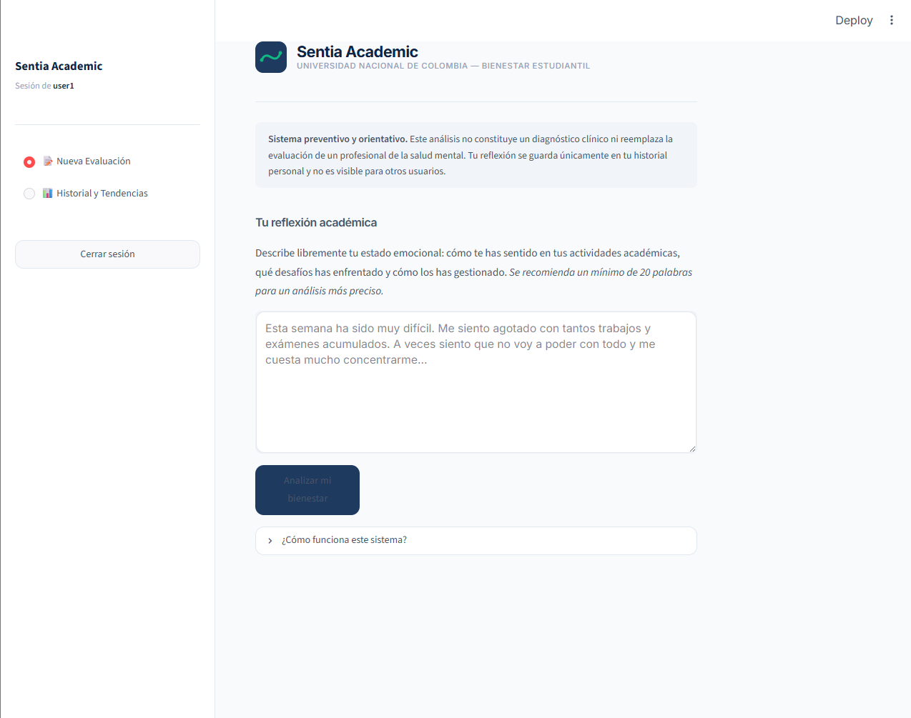
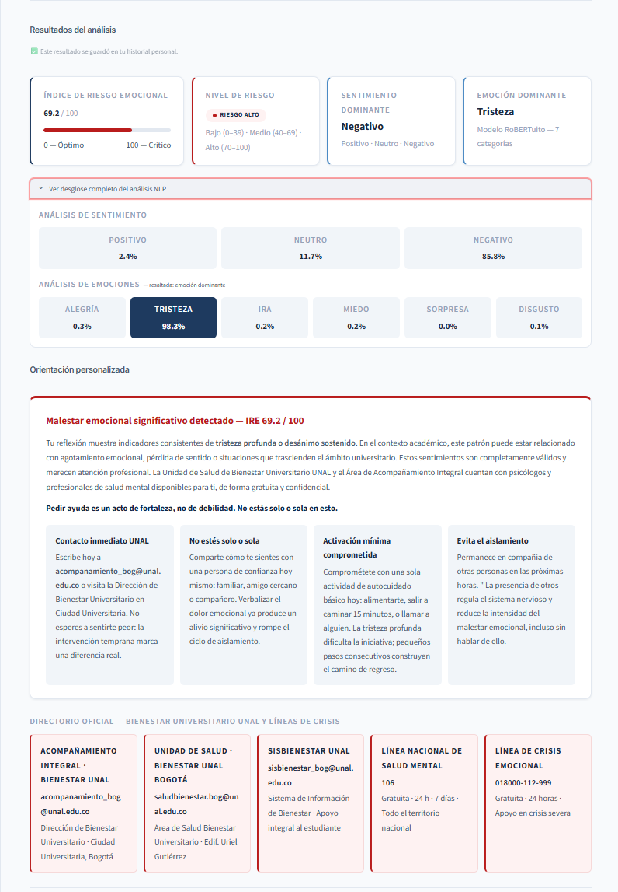
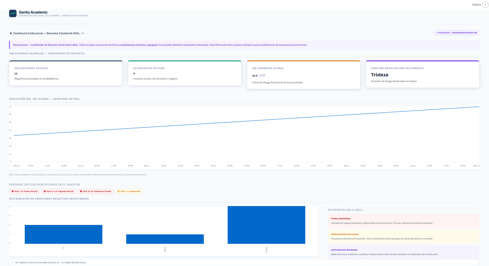

<div align="center">

# 🎓 Sentia Academic

### Plataforma Institucional de Analítica y Prevención del Burnout Estudiantil

Sistema inteligente basado en **Procesamiento de Lenguaje Natural (NLP)** y **Deep Learning** para la detección temprana del burnout estudiantil.

<br>


</div>

---

# 📑 Índice

- 📖 Sobre el Proyecto
- 🚀 Tour por la Aplicación
- 🖼️ Capturas de Pantalla
- ⚙️ Guía de Instalación
- 🔑 Credenciales de Prueba
- 🧠 Tecnologías Utilizadas
- 📂 Estructura del Proyecto

---

# 📖 Sobre el Proyecto

**Sentia Academic** es un sistema desarrollado en Python diseñado para monitorear el bienestar emocional de la comunidad universitaria.

Utiliza **Procesamiento de Lenguaje Natural (NLP)** y modelos de **Deep Learning** (*RoBERTuito*, optimizado para español) para analizar textos reflexivos de los estudiantes, detectar niveles de estrés crónico (**Burnout**) y activar alertas tempranas vinculadas a los canales de Bienestar Universitario.

---

# 🚀 Tour por la Aplicación

El sistema opera bajo un entorno de acceso seguro y divide sus funcionalidades según el tipo de usuario.

---

## 👤 Vista de Estudiante

Cualquier persona puede registrarse en la plataforma para llevar un control de su salud mental.

### 📝 Nueva Evaluación

- Diario interactivo donde el estudiante escribe cómo se siente.
- La IA analiza el texto en segundos.
- Detecta emociones predominantes (Ira, Tristeza, Miedo, Alegría, etc.).
- Calcula automáticamente el **Índice de Riesgo Emocional (IRE).**

### 💡 Orientación Personalizada

Dependiendo del nivel de riesgo detectado, el sistema ofrece recomendaciones inmediatas y canales de atención institucional.

### 📊 Historial y Tendencias

Cada estudiante dispone de un panel privado con:

- Evolución emocional.
- Historial completo.
- Exportación del historial en formato **CSV**.

---

## 🛡️ Vista Institucional (Psicólogo / Coordinador)

Pensada para la toma de decisiones preservando el anonimato.

### 📈 Dashboard General

Visualización agregada del estado emocional de toda la comunidad.

### 🗓️ Mapeo de Estrés

Permite detectar semanas críticas como:

- Parciales
- Finales
- Entregas importantes

### 🔐 Acceso Administrativo

Ingreso mediante el usuario reservado:

```text
admin_psico
```

---

# 🖼️ Capturas de Pantalla

> Agrega aquí tus imágenes.

## 🏠 Página Principal

<p align="center">

</p>

---

## 📝 Evaluación Emocional

<p align="center">

</p>

---

## 📊 Dashboard Institucional

<p align="center">

</p>

---

# ⚙️ Guía de Instalación

Cualquier persona puede ejecutar la aplicación siguiendo estos pasos.

---

## Paso 1️⃣ Verificar e Instalar Python

Abre una terminal y escribe:

```bash
python --version
```

Si aparece una versión (por ejemplo `Python 3.10.x`), continúa con el siguiente paso.

Si no está instalado, descárgalo desde:

https://www.python.org/downloads/

> ⚠️ **Usuarios Windows:** Durante la instalación marca la opción **Add python.exe to PATH** antes de pulsar **Install Now**.

---

## Paso 2️⃣ Abrir el Proyecto

Descarga este repositorio mediante:

- **Code → Download ZIP**
- o usando:

```bash
git clone <URL_DEL_REPOSITORIO>
```

Luego abre la carpeta del proyecto.

<details>

<summary><b>🔹 Opción A: Visual Studio Code (Recomendado)</b></summary>

1. Abrir la carpeta del proyecto.
2. Ir a **Terminal → New Terminal**.

</details>

<details>

<summary><b>🔸 Opción B: CMD / Terminal</b></summary>

1. Abrir la carpeta.
2. Escribir `cmd` en la barra de direcciones.
3. Presionar **Enter**.

</details>

---

## Paso 3️⃣ Crear el Entorno Virtual

En la terminal escribe:

```bash
python -m venv env
```

Espera unos segundos hasta que aparezca una nueva carpeta llamada **env**.

Ahora actívalo.

### 🪟 Windows

```bash
.\env\Scripts\activate
```

### 🍎 macOS / Linux

```bash
source env/bin/activate
```

Si todo salió bien aparecerá algo parecido a:

```text
(env) C:\Proyecto>
```

---

## Paso 4️⃣ Instalar las Librerías

Con el entorno activado ejecuta:

```bash
python -m pip install -r requirements.txt
```

> ⏳ Este proceso puede tardar algunos minutos porque descargará librerías grandes como PyTorch y Streamlit.

---

## Paso 5️⃣ Ejecutar la Aplicación

Finalmente inicia el servidor:

```bash
python -m streamlit run app.py
```

Después de unos segundos se abrirá automáticamente el navegador.

> **Primera ejecución:** La primera evaluación descargará automáticamente los modelos de IA (aprox. 500 MB). En las siguientes ejecuciones el análisis será inmediato.

---

# 🔑 Credenciales de Prueba

Para acceder al módulo institucional utiliza:

```text
Usuario: admin_psico
Contraseña: Psico@UNAL2024
```

> Si modificaste la contraseña dentro del proyecto, utiliza la que configuraste.

Para probar el módulo de estudiante simplemente crea una cuenta nueva desde la pestaña **Registrarse**.

---

# 🧠 Tecnologías Utilizadas

| Tecnología | Uso |
|------------|-----|
| Python | Backend |
| Streamlit | Interfaz Web |
| SQLite | Base de Datos |
| PyTorch | Deep Learning |
| Transformers | Procesamiento de Lenguaje Natural |
| Pandas | Manipulación de Datos |
| Plotly | Visualización de Datos |

---

# 📂 Estructura del Proyecto

```text
SentiaAcademic/
│
├── app.py
├── requirements.txt
├── sentia.db
├── images/
└── README.md
```

---

<div align="center">

## ❤️ Desarrollado con Python, Streamlit e Inteligencia Artificial

**Proyecto Académico**

</div>
